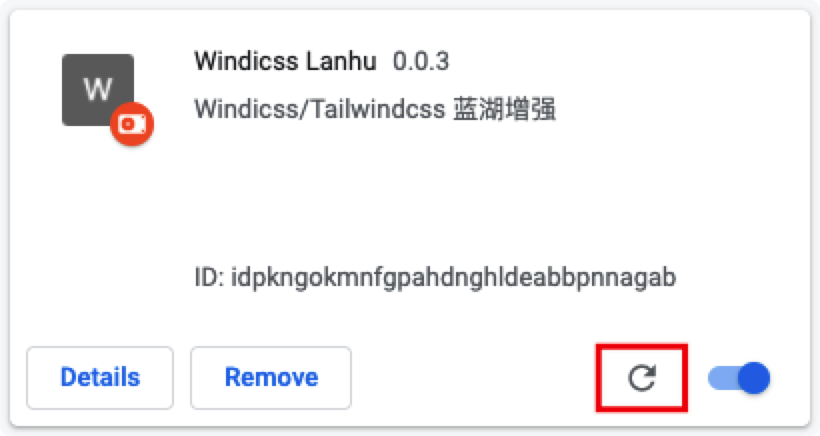

# windicss 蓝湖增强(chrome 插件)


## dev

1. 运行开发脚本

```shell
yarn && yarn dev
```

2. 打开 chrome 插件管理，`chrome://extensions`

3. 启用开发模式


4. 加载插件目录（如果是别人分享的 zip 文件，需要先解压）


> 导入项目根目录下的 `windicss-lanhu` 目录，进行预览。

5. 代码修改后需要在插件管理页面重新加载下插件。



## build

> build 的结果可以打包成 zip 文件共享给其他人使用，安装方式参考开发中的加载方式。

```shell
yarn && yarn build
```
